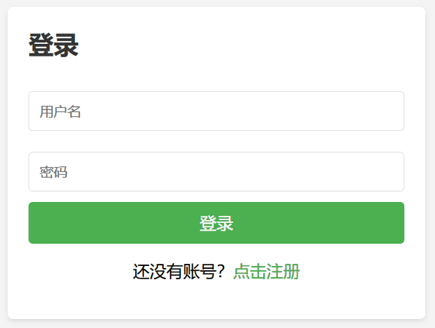
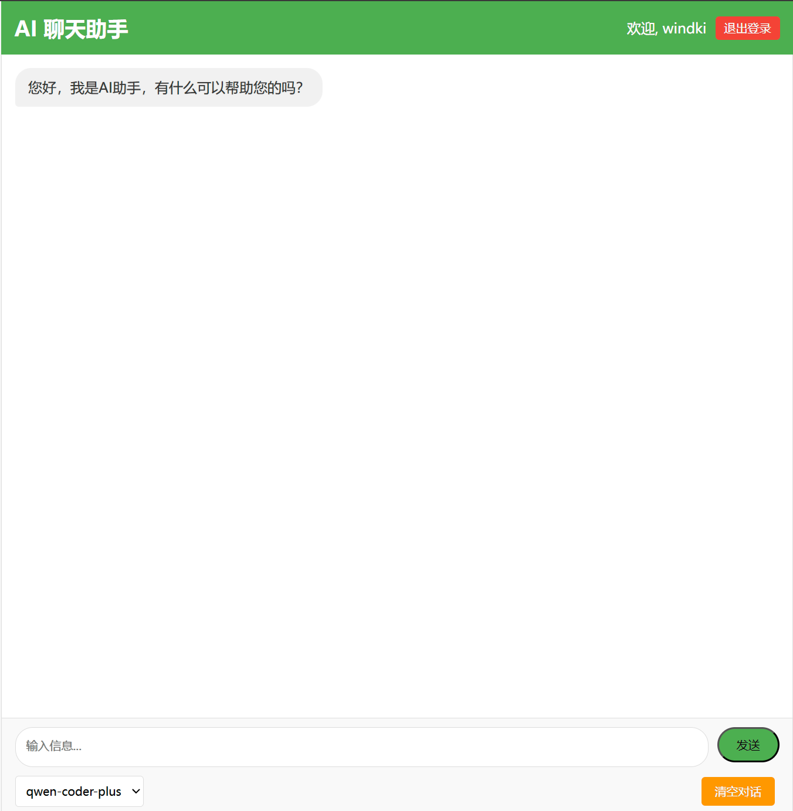

# AIhelper

A lightweight AI assistant API service that integrates with OpenAI-compatible APIs to provide chat functionalities.

## Features

- User authentication system with registration and login
- Token-based authentication for API requests
- Support for OpenAI-compatible APIs (like Aliyun Dashscope)
- Real-time streaming response with thinking process display
- Web interface for testing and interaction
- Multiple AI models support

## Installation

1. Clone the repository
2. Install dependencies:

```bash
npm install
```

3. Configure your settings:

```bash
cp config-example.json config.json
```

4. Edit `config.json` with your API key and preferred settings
5. Start the server:

```bash
npm start
```

## Configuration

The `config.json` file contains the following settings:

- `hostname`: Server hostname (default: "localhost")
- `port`: Server port number (default: 3000)
- `OPEN_AI_API_KEY`: Your API key for OpenAI-compatible services
- `OPEN_AI_API_URL`: The API endpoint (default: "https://dashscope.aliyuncs.com/compatible-mode/v1")
- `available_models`: Array of available AI models

## API Endpoints

### Authentication

#### Register
- **URL**: `/register`
- **Method**: `POST`
- **Body**: `{ "username": "your_username", "password": "your_password" }`

#### Login
- **URL**: `/login`
- **Method**: `POST`
- **Body**: `{ "username": "your_username", "password": "your_password" }`
- **Returns**: `{ "token": "auth_token", "userId": "user_id", "username": "username" }`

### API Functions

#### Get Available Models
- **URL**: `/api?token=your_token&getModels=true`
- **Method**: `GET`
- **Returns**: List of available AI models

#### Chat with AI
- **URL**: `/openai-stream?token=your_token&model=model_name&prompt=your_prompt`
- **Method**: `GET`
- **Returns**: Server-sent events (SSE) stream with AI response

## Web Interface

Access the web interface at `http://localhost:3000/index.html` (or your configured hostname and port). The interface provides:


- User authentication
- Model selection
- Chat history with markdown support
- Code highlighting
- Copy functionality

## Security

- Passwords are securely hashed using bcrypt
- Temporary authentication tokens expire after 5 minutes
- Actions are logged for security monitoring

## Dependencies

- Express.js: Web server framework
- OpenAI: API client for AI services
- SQLite3: User database
- bcrypt: Password hashing
- body-parser: Request parsing middleware
```
AIhelper
├─ backend.js
├─ config-example.json
├─ css
│  ├─ auth.css
│  └─ styles.css
├─ index.html
├─ js
│  ├─ login.js
│  ├─ register.js
│  └─ script.js
├─ login.html
├─ package.json
├─ readme.md
└─ register.html

```